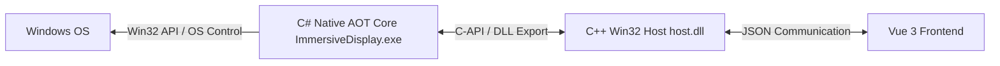

# DisplayTrackTool (Immersive Display Track Tool)

[](https://dotnet.microsoft.com/)
[](https://visualstudio.microsoft.com/)
[](https://vuejs.org/)
[](https://www.microsoft.com/windows)

A window immersive management and display synchronization control tool for the Windows platform. Adopting a **C# Native AOT + C++ Win32 + Vue 3** hybrid architecture, it integrates a Web-based user interface, C# business logic, and C++ native performance with AOT compatibility.

---

## 🌟 Core Features

* **⚡ Fast & Lightweight**: The C# core logic is compiled via Native AOT, eliminating dependencies on large .NET runtimes or traditional UI frameworks (such as WPF or WinForms). It offers fast cold startup and low memory usage.
* **📐 Responsive Window Layout**: Automatically adjusts and switches to the optimal display layout and orientation based on the direction and dimensions of the target window.
* **🖥️ Display Synchronization**: Automatically detects and adjusts physical display rotation (landscape/portrait) and resolution in the background.
* **🔗 Associated Startup Management**: Supports linked startup or termination of specified associated applications to simplify multi-software operations.

---

## 🏗️ Architecture Design

The project implements a decoupled three-layer architecture to balance operational efficiency and modularity:



---

## 📂 Directory Structure

```text
DisplayTrackTool/
├── ImmersiveDisplay/      # [C#] Core logic layer (Windows AOT App)
│   ├── Services/          # Window tracking, display control services
│   ├── Helpers/           # Native Win32 API wrappers
│   └── Interop/           # Interop definitions for C++ host.dll
├── webview-wrapper/       # [C++] UI host layer (CMake project)
│   ├── src/               # Win32 WebView2 host implementation
│   └── include/           # C-Style exported interfaces
├── vite-project/          # [Vue 3] Interactive frontend (Vite)
├── DOC/                   # Design documentation and specifications
├── build.py               # 🐍 Python build orchestration script
└── profiles.json          # Persistent configuration (auto-generated)
```

---

## 🛠️ Build Requirements

Ensure the following toolchains are installed on your Windows environment before building the project:

1. **Visual Studio 2022/2026 / CMake (3.20+)**
   * Requires: **"Desktop development with C++"** workload.
2. **.NET 10.0 SDK**
   * Used for compiling the C# main program with Native AOT.
3. **Node.js (v24+)**
   * Used for building the Vue 3 frontend.
4. **Python (3.12+)**
   * Used for running the automated build orchestrator.

---

## 🚀 Build Guide

A **Python orchestration script `build.py`** is provided to automate dependency installation, cross-project compilation, asset copying, packaging, and validation.

### Method 1: Using `build.py` (Recommended)

#### 1. Full Build
Open your terminal (PowerShell or CMD) and run:
```bash
python build.py
```
*This command automatically builds the frontend, C++ dynamic library, C# AOT program, organizes the outputs, and validates build integrity.*

#### 2. Quick Rebuild (Skip Frontend)
If you only modified C++ or C# code, you can skip the frontend build process to save compilation time:
```bash
python build.py --skip-frontend
```

#### 3. Build and Package to Zip
Excludes temporary files and debugging symbols (e.g., `.pdb` files) to generate a clean distribution archive:
```bash
python build.py --skip-frontend --package
```

#### 4. Build Arguments

| Argument | Description | Note |
| :--- | :--- | :--- |
| `python build.py` | Full pipeline build | Builds all layers, deploys, and verifies |
| `python build.py --skip-frontend` | Build and skip Vue compilation | Useful when only modifying C# or C++ backend code |
| `python build.py --package` | Package into zip after build | Generates `DisplayTrackTool.zip` excluding `.pdb` |
| `python build.py --frontend` | Build frontend only | Outputs to `vite-project/dist` |
| `python build.py --cpp` | Compile C++ host.dll only | Outputs to `webview-wrapper/build/Release` |
| `python build.py --csharp` | Compile C# main program only | Outputs to `Release/` |
| `python build.py --clean` | Clean all build outputs | Deletes `bin/`, `obj/`, `dist/`, and `build/` directories |

---

### Method 2: Manual Step-by-Step Build (For Debugging)

#### Step 1: Build the Vue 3 Frontend
```bash
cd vite-project
npm install
npm run build
```
*Output resides in `/vite-project/dist/`.*

#### Step 2: Build the C++ host.dll
```bash
cd webview-wrapper
mkdir build && cd build
cmake ..
cmake --build . --config Release
```
*Output resides in `/webview-wrapper/build/Release/host.dll`.*

#### Step 3: Build the C# ImmersiveDisplay Program
```bash
cd ImmersiveDisplay
dotnet publish -c Release --output ../Release
```
*Triggers Native AOT compilation and generates the output directory `/Release` at the project root.*

#### Step 4: Manually Organize Assets
1. Copy `vite-project/dist/index.html` to `Release/WebUI/index.html`.
2. Copy `webview-wrapper/build/Release/host.dll` to `Release/host.dll`.
3. Copy `webview-wrapper/build/_deps/webview2-src/build/native/x64/WebView2Loader.dll` to `Release/WebView2Loader.dll`.

---

## 🏁 Run & Debug

Navigate to the generated `/Release` directory:
```bash
cd Release
```
Run **`ImmersiveDisplay.exe`**.

* **Logs**: Run the executable from a terminal in development environments to monitor `DllImport` statuses and logic layer interactions.
* **Persistent Configuration**: `profiles.json` will be automatically generated in the same directory upon startup. UI configuration changes are written directly to this file.

---

## 🛡️ Best Practices & Design Notes

1. **AOT Compatibility**: Avoids runtime COM and dynamic reflection. Interactions between C# and Win32 APIs are implemented using native pointers and `LibraryImport` to ensure stability in Native AOT.
2. **Stateless Gateway**: The C++ host is focused on Win32 window lifecycle management and WebView2. Acting as a stateless UI host allows the frontend framework to be updated independently without modifying native layers.
